# StoreMyBottle MVP Implementation Plan

## Development Approach: Iterative Only

This project follows a strict iterative development strategy:

- **40 small iterations** broken into 9 phases
- Each iteration produces a **working, testable result**
- Server must run after each iteration
- Database remains consistent throughout
- Flow matches real-world usage
- No partial implementations
- Test happy path + 1 failure case before proceeding
- Freeze code after each iteration
- Only proceed after confirmation

**Estimated Time**: 30-60 minutes per iteration

## Critical Development Rules

### Scaffolding & Dependencies

- **DO NOT** assume libraries are installed
- **ALWAYS** scaffold projects and install dependencies via terminal commands
- Use terminal commands (`npm init`, `npm install`, `npm run`, etc.) exactly as a human developer would
- **NEVER** "mentally assume" a package exists
- Verify installations before writing code that depends on them

### Package Manager

- **USE npm STRICTLY** - Do not use yarn, pnpm, bun, or any alternative
- Ensure `package.json` and `package-lock.json` remain in sync
- Always commit `package-lock.json` to version control

### Incremental Backend Development

- Build the backend **iteratively, one small feature or endpoint at a time**
- **DO NOT** implement the full backend in one shot
- Each endpoint must be tested before moving to the next

### Testing Discipline

- **After every backend iteration**, test all relevant endpoints using `curl` commands
- Show the **exact curl commands** used for testing
- **DO NOT** proceed to the next iteration until endpoints are verified
- Test both success and failure cases with curl
- **Periodically check TypeScript errors** during development
- Run `npx tsc --noEmit` (or `npm run type-check` if configured) before committing
- Fix all TypeScript errors before proceeding to next iteration

### No Premature Code Writing

**DO NOT** start typing application code before:

1. Project structure is scaffolded
2. Dependencies are installed (via `npm install`)
3. Scripts are verified via terminal (`npm run dev`, etc.)
4. Configuration files are in place

### Human-like Workflow

Follow a real-world developer workflow in this exact order:

1. **Scaffold** - Create project structure (`npm init`, create directories)
2. **Install** - Install dependencies (`npm install <package>`)
3. **Configure** - Set up config files (`.env`, `tsconfig.json`, etc.)
4. **Implement** - Write the actual code
5. **Type Check** - Check for TypeScript errors (`npx tsc --noEmit` or `npm run type-check`)
6. **Test** - Test with curl commands (for backend) or manual testing (for frontend)
7. **Iterate** - Only then proceed to next iteration

**Avoid shortcuts or assumptions.**

## Available MCP Servers

The following MCP servers are available and should be used during development:

### Chrome DevTools MCP Server

- **Purpose**: Browser automation, testing, and debugging
- **Use Cases**:
  - Test frontend apps in real browser
  - Verify mobile responsiveness (320px, 375px, 428px viewports)
  - Test QR code scanning functionality
  - Debug UI issues
  - Verify Clerk authentication flows
  - Test mobile-first layouts
  - Verify touch interactions
- **When to Use**: After frontend iterations, especially for mobile testing and QR code functionality
- **Commands**: Use browser navigation, snapshot, and interaction tools

### Clerk MCP Server

- **Purpose**: Clerk authentication setup and configuration
- **Use Cases**:
  - Configure Clerk authentication
  - Set up OAuth providers (Gmail)
  - Configure Phone OTP
  - Get Clerk keys and configuration
  - Test authentication flows
  - Manage user sessions
- **When to Use**: During Clerk integration iterations (Iterations 4, 12, 20, 32-34, 38)
- **Benefits**: Streamlines Clerk setup and configuration

### shadcn/ui MCP Server

- **Purpose**: shadcn/ui component management and configuration
- **Use Cases**:
  - Initialize shadcn/ui in projects
  - Add shadcn/ui components (Button, Card, Input, etc.)
  - Configure Tailwind CSS
  - Manage component installation
  - Update component configurations
  - Generate component code
- **When to Use**: During frontend setup iterations (Iterations 9, 19, 37) and when adding new components
- **Benefits**: Faster component setup and management

**Note**: Use MCP servers to streamline setup and configuration. However, still follow the workflow: scaffold → install → configure → implement → test. MCP servers complement but don't replace the iterative development process.

### TypeScript Error Checking

- **Check TypeScript errors periodically** during code implementation
- Run type checking after significant code changes
- **Always check before committing** or moving to next iteration
- Fix all TypeScript errors before proceeding
- Use `npx tsc --noEmit` for backend projects
- Use `npx tsc --noEmit` or IDE TypeScript checking for frontend projects
- Configure `package.json` scripts for convenience:
  ```json
  "scripts": {
    "type-check": "tsc --noEmit"
  }
  ```


## Mobile-First Design Requirements

### Core Principle

**Even though this is a web application, assume it will be used primarily on mobile devices.**

All customer and bartender interfaces must be designed with a mobile-first approach.

### Responsiveness Requirements

All screens must be fully responsive across:

- **Small phones** (320px - 375px)
- **Large phones** (376px - 428px)
- **Tablets** (429px - 768px)
- **Desktop** (769px+) - Secondary, adapts from mobile

**Desktop layouts are secondary** and should adapt from mobile, not the other way around.

### Touch-Optimized UI

- **Large tap targets**: Minimum 44x44px for buttons and interactive elements
- **No hover-dependent interactions**: All functionality must work without hover states
- **One-handed usability**: Primary actions should be reachable with thumb
- **Spacing**: Adequate spacing between interactive elements to prevent mis-taps
- **Input fields**: Large enough for easy mobile keyboard input

### Performance on Mobile

- **Optimize layouts**: Use efficient CSS (Tailwind utilities)
- **Lightweight components**: Avoid heavy UI elements that degrade performance
- **Fast rendering**: Components should render quickly on mobile browsers
- **Minimal JavaScript**: Keep client-side logic lean

### UX Assumptions

**Bartenders may use the app:**

- One-handed (while holding bottles, serving customers)
- In low-light environments (bars/clubs)
- In fast-paced scenarios (busy service times)

**Design flows to be:**

- Quick - Minimal taps to complete actions
- Minimal - Only essential information displayed
- Distraction-free - Clear, focused interfaces

### Consistency

Maintain consistent design patterns between:

- Customer app
- Bartender app
- Admin app (can be desktop-optimized)

Shared components should adapt responsively rather than fork logic.

### Styling Approach

**Build fully functional, mobile-first, responsive web apps first, without styling.**

- Focus on functionality and structure
- Use semantic HTML and basic layout
- Styling is applied only when explicitly instructed
- shadcn/ui components provide base styling, but ensure mobile-first responsive behavior

### Mobile-First Checklist

For every frontend iteration, verify:

1. ✅ Layout works on 320px width (smallest mobile)
2. ✅ All buttons are at least 44x44px
3. ✅ No hover-only interactions
4. ✅ Text is readable without zooming
5. ✅ Forms are easy to fill on mobile keyboard
6. ✅ Navigation is thumb-reachable
7. ✅ QR codes are scannable size on mobile screens
8. ✅ Loading states work on slow mobile connections

## Architecture Overview

Three frontend web applications sharing one backend API and database:

- **Customer Web App** - Browse venues, purchase bottles, redeem pegs
- **Bartender Web App** - Mark payments, scan QR codes, serve pegs
- **Admin Web App** - Manage venues, bottles, users, view analytics

## Architecture Diagram

```mermaid
graph TB
    subgraph frontend [Frontend Applications]
        CustomerApp[Customer Web App<br/>React + shadcn/ui<br/>Mobile-First]
        BartenderApp[Bartender Web App<br/>React + shadcn/ui<br/>Mobile-First]
        AdminApp[Admin Web App<br/>React + shadcn/ui]
    end

    subgraph backend [Backend API]
        ExpressAPI[Express.js API<br/>TypeScript<br/>Node.js]
        
        subgraph controllers [Controllers]
            AuthCtrl[Auth Controller]
            VenueCtrl[Venue Controller]
            BottleCtrl[Bottle Controller]
            PaymentCtrl[Payment Controller]
            RedemptionCtrl[Redemption Controller]
            AdminCtrl[Admin Controller]
        end

        subgraph middleware [Middleware]
            AuthMW[Auth Middleware<br/>Clerk Validation]
            RoleMW[Role Middleware<br/>Customer/Bartender/Admin]
        end

        subgraph services [Services]
            QRService[QR Service<br/>Generate QR Codes]
            UserSync[User Sync Service<br/>Clerk to DB]
        end
    end

    subgraph database [Database]
        PostgreSQL[(PostgreSQL Database)]
        
        subgraph tables [Tables]
            UsersTable[users]
            VenuesTable[venues]
            BottlesTable[bottles]
            PurchasesTable[purchases]
            RedemptionsTable[redemptions]
        end
    end

    subgraph external [External Services]
        Clerk[Clerk Authentication<br/>Gmail OAuth + Phone OTP<br/>Free Tier]
    end

    subgraph mcp [MCP Servers]
        ChromeMCP[Chrome DevTools MCP<br/>Browser Testing]
        ClerkMCP[Clerk MCP<br/>Configuration]
        ShadcnMCP[shadcn/ui MCP<br/>Component Management]
    end

    %% Frontend to Backend connections
    CustomerApp -->|HTTP/REST API| ExpressAPI
    BartenderApp -->|HTTP/REST API| ExpressAPI
    AdminApp -->|HTTP/REST API| ExpressAPI

    %% Backend internal flow
    ExpressAPI --> AuthMW
    AuthMW --> RoleMW
    RoleMW --> controllers
    controllers --> services
    controllers --> PostgreSQL

    %% Database connections
    PostgreSQL --> tables

    %% Authentication flow
    CustomerApp -.->|OAuth/OTP| Clerk
    BartenderApp -.->|OAuth/OTP| Clerk
    AdminApp -.->|OAuth/OTP| Clerk
    Clerk -.->|Validate Tokens| AuthMW
    Clerk -.->|User Data| UserSync
    UserSync --> UsersTable

    %% QR Code flow
    PaymentCtrl --> QRService
    RedemptionCtrl --> QRService
    QRService -->|Generate QR| CustomerApp
    QRService -->|Generate QR| BartenderApp

    %% MCP Server connections
    ChromeMCP -.->|Test & Debug| CustomerApp
    ChromeMCP -.->|Test & Debug| BartenderApp
    ClerkMCP -.->|Configure| Clerk
    ShadcnMCP -.->|Manage Components| CustomerApp
    ShadcnMCP -.->|Manage Components| BartenderApp
    ShadcnMCP -.->|Manage Components| AdminApp

    %% Data flow annotations
    CustomerApp -->|"1. Select Venue"| VenueCtrl
    CustomerApp -->|"2. Select Bottle"| BottleCtrl
    CustomerApp -->|"3. Create Account"| AuthCtrl
    CustomerApp -->|"4. Initiate Payment"| PaymentCtrl
    CustomerApp -->|"5. Get Payment QR"| QRService
    CustomerApp -->|"6. View My Bottles"| RedemptionCtrl
    CustomerApp -->|"7. Request Peg"| RedemptionCtrl
    CustomerApp -->|"8. Get Redemption QR"| QRService

    BartenderApp -->|"5. View Pending Payments"| PaymentCtrl
    BartenderApp -->|"5. Mark Payment Paid"| PaymentCtrl
    BartenderApp -->|"9. Scan QR Code"| RedemptionCtrl
    BartenderApp -->|"9. Serve Peg"| RedemptionCtrl

    AdminApp -->|"Manage Venues"| VenueCtrl
    AdminApp -->|"Manage Bottles"| BottleCtrl
    AdminApp -->|"View Analytics"| AdminCtrl

    style CustomerApp fill:#e1f5ff
    style BartenderApp fill:#fff4e1
    style AdminApp fill:#f0e1ff
    style ExpressAPI fill:#e8f5e9
    style PostgreSQL fill:#fff3e0
    style Clerk fill:#fce4ec
    style ChromeMCP fill:#f3e5f5
    style ClerkMCP fill:#f3e5f5
    style ShadcnMCP fill:#f3e5f5
```



### Architecture Components

**Frontend Layer:**

- Three separate React applications (Customer, Bartender, Admin)
- Mobile-first design with shadcn/ui components
- Clerk authentication integration
- QR code display and scanning

**Backend Layer:**

- Express.js REST API with TypeScript
- Controllers handle business logic
- Middleware for authentication and authorization
- Services for QR generation and user synchronization

**Database Layer:**

- PostgreSQL with normalized schema
- Tables: users, venues, bottles, purchases, redemptions
- Foreign key relationships for data integrity

**External Services:**

- Clerk for authentication (Gmail OAuth + Phone OTP)
- Free tier suitable for MVP

**MCP Servers:**

- Chrome DevTools MCP for browser testing
- Clerk MCP for authentication configuration
- shadcn/ui MCP for component management

### Data Flow

1. **Customer Flow**: Select venue → Select bottle → Authenticate → Initiate payment → Get QR → View bottles → Request peg → Get redemption QR
2. **Bartender Flow**: Authenticate → View pending payments → Mark paid → Scan redemption QR → Serve peg
3. **Admin Flow**: Authenticate → Manage venues/bottles → View analytics

## Technology Stack

- **Frontend**: React (with React Router) + shadcn/ui components
- **Backend**: Express.js + Node.js (TypeScript)
- **Database**: PostgreSQL
- **Authentication**: Clerk (Gmail OAuth + Phone/Email OTP - free tier available)
- **QR Codes**: qrcode library for generation, camera API for scanning
- **UI Components**: shadcn/ui (Tailwind CSS based component library)

## Project Structure

```
StoreMyBottle/
├── backend/
│   ├── src/
│   │   ├── config/
│   │   │   └── database.ts
│   │   ├── controllers/
│   │   │   ├── auth.controller.ts
│   │   │   ├── venue.controller.ts
│   │   │   ├── bottle.controller.ts
│   │   │   ├── payment.controller.ts
│   │   │   └── redemption.controller.ts
│   │   ├── models/
│   │   │   ├── User.ts
│   │   │   ├── Venue.ts
│   │   │   ├── Bottle.ts
│   │   │   ├── Purchase.ts
│   │   │   └── Redemption.ts
│   │   ├── routes/
│   │   │   ├── auth.routes.ts
│   │   │   ├── venue.routes.ts
│   │   │   ├── bottle.routes.ts
│   │   │   ├── payment.routes.ts
│   │   │   └── redemption.routes.ts
│   │   ├── middleware/
│   │   │   ├── auth.middleware.ts
│   │   │   └── role.middleware.ts
│   │   ├── services/
│   │   │   └── qr.service.ts
│   │   └── app.ts
│   ├── package.json
│   └── tsconfig.json
├── frontend-customer/
│   ├── src/
│   │   ├── components/
│   │   │   └── ui/ (shadcn/ui components)
│   │   ├── pages/
│   │   │   ├── VenueSelection.tsx
│   │   │   ├── BottleSelection.tsx
│   │   │   ├── Login.tsx
│   │   │   ├── Payment.tsx
│   │   │   ├── MyBottles.tsx
│   │   │   └── RedeemPeg.tsx
│   │   ├── App.tsx
│   │   └── main.tsx
│   ├── components.json (shadcn/ui config)
│   ├── tailwind.config.js
│   └── package.json
├── frontend-bartender/
│   ├── src/
│   │   ├── components/
│   │   │   └── ui/ (shadcn/ui components)
│   │   ├── pages/
│   │   │   ├── Login.tsx
│   │   │   ├── PendingPayments.tsx
│   │   │   └── ScanQR.tsx
│   │   ├── App.tsx
│   │   └── main.tsx
│   ├── components.json (shadcn/ui config)
│   ├── tailwind.config.js
│   └── package.json
├── frontend-admin/
│   ├── src/
│   │   ├── components/
│   │   │   └── ui/ (shadcn/ui components)
│   │   ├── pages/
│   │   │   ├── Login.tsx
│   │   │   ├── Dashboard.tsx
│   │   │   ├── VenueManagement.tsx
│   │   │   └── BottleManagement.tsx
│   │   ├── App.tsx
│   │   └── main.tsx
│   ├── components.json (shadcn/ui config)
│   ├── tailwind.config.js
│   └── package.json
└── database/
    └── migrations/
        └── 001_initial_schema.sql
```

## Database Schema

### Core Tables

**users**

- id (UUID, PK)
- email (string, nullable)
- phone (string, nullable)
- password_hash (string, nullable)
- role (enum: 'customer', 'bartender', 'admin')
- created_at (timestamp)

**venues**

- id (UUID, PK)
- name (string)
- address (string)
- created_at (timestamp)

**bottles**

- id (UUID, PK)
- venue_id (UUID, FK)
- name (string)
- brand (string)
- price (decimal)
- total_ml (integer)
- is_active (boolean)

**purchases**

- id (UUID, PK)
- user_id (UUID, FK)
- bottle_id (UUID, FK)
- venue_id (UUID, FK)
- payment_status (enum: 'pending', 'paid', 'cancelled')
- payment_qr_code (string) - QR code for offline payment
- remaining_ml (integer) - starts at total_ml, decreases with redemptions
- created_at (timestamp)
- paid_at (timestamp, nullable)

**redemptions**

- id (UUID, PK)
- purchase_id (UUID, FK)
- user_id (UUID, FK)
- peg_size_ml (integer) - 30, 45, or 60
- redemption_token (UUID, unique) - for QR code
- status (enum: 'pending', 'served', 'expired')
- created_at (timestamp)
- served_at (timestamp, nullable)
- served_by (UUID, FK to users, nullable)

## Backend API Endpoints

### Authentication Routes (`/api/auth`)

- Clerk handles all authentication (Gmail OAuth, Phone OTP, Email OTP)
- `GET /api/auth/user` - Get current user (protected, uses Clerk session)
- Backend validates Clerk session tokens
- User data synced to local database for role management

### Venue Routes (`/api/venues`)

- `GET /` - List all venues (public)
- `GET /:id` - Get venue details
- `POST /` - Create venue (admin only)
- `PUT /:id` - Update venue (admin only)

### Bottle Routes (`/api/bottles`)

- `GET /venue/:venueId` - List bottles for a venue
- `GET /:id` - Get bottle details
- `POST /` - Create bottle (admin only)
- `PUT /:id` - Update bottle (admin only)

### Payment Routes (`/api/payments`)

- `POST /initiate` - Create purchase with pending payment (customer)
- `GET /pending` - List pending payments (bartender)
- `PUT /:id/mark-paid` - Mark payment as paid (bartender)

### Redemption Routes (`/api/redemptions`)

- `POST /request` - Request peg redemption, get QR code (customer)
- `GET /my-redemptions` - List user's redemptions (customer)
- `POST /scan` - Scan QR code and serve peg (bartender)
- `GET /my-bottles` - List user's virtual bottles (customer)

### Admin Routes (`/api/admin`)

- `GET /dashboard` - Dashboard stats
- `GET /users` - List all users
- `GET /purchases` - List all purchases
- `GET /redemptions` - List all redemptions

## Frontend Features

### Customer App Flow

1. **Venue Selection** - Browse and select venue
2. **Bottle Selection** - View bottles, select one
3. **Account Creation** - Login/Register (Gmail or Phone)
4. **Payment Initiation** - Generate payment QR code, show to bartender
5. **My Bottles** - View virtual bottles after payment confirmed
6. **Redeem Peg** - Select peg size (30/45/60mL), generate redemption QR code
7. **QR Display** - Show QR code for bartender to scan

### Bartender App Flow

1. **Login** - Authenticate as bartender
2. **Pending Payments** - View list of pending payments with QR codes
3. **Mark Paid** - Confirm payment received, activate virtual bottle
4. **Scan QR** - Scan redemption QR code, serve peg, update database

### Admin App Flow

1. **Login** - Authenticate as admin
2. **Dashboard** - View analytics (total bottles, redemptions, revenue)
3. **Venue Management** - CRUD operations for venues
4. **Bottle Management** - CRUD operations for bottles
5. **User Management** - View all users and their purchases

## Key Implementation Details

### Authentication

- **Clerk Authentication** - Handles all auth methods:
  - Gmail/Google OAuth
  - Phone OTP (SMS)
  - Email OTP
  - Email/Password
- Backend validates Clerk session tokens
- User data synced to local database for role management (customer, bartender, admin)
- Role-based access control using Clerk metadata or local database

**Clerk Free Tier:**

- 10,000 MAU (Monthly Active Users)
- Unlimited sessions
- All authentication methods included
- Perfect for MVP development

### QR Code Generation

- Payment QR: Contains purchase ID + unique token
- Redemption QR: Contains redemption token (UUID)
- Use `qrcode` npm package for generation
- QR codes expire after 24 hours for security

### Payment Flow (Offline)

1. Customer initiates purchase → Backend creates purchase with `payment_status: 'pending'`
2. Backend generates payment QR code containing purchase ID
3. Customer shows QR to bartender
4. Bartender scans QR → Sees purchase details
5. Bartender marks as paid → `payment_status: 'paid'`, `remaining_ml` initialized
6. Customer's virtual bottle appears in "My Bottles"

### Redemption Flow

1. Customer selects bottle and peg size (30/45/60 mL)
2. Backend validates: `remaining_ml >= peg_size_ml`
3. Backend creates redemption record with unique token
4. Customer gets QR code with redemption token
5. Customer shows QR to bartender
6. Bartender scans QR → Backend validates token, marks as served
7. Backend decrements `remaining_ml` from purchase

## Security Considerations

- JWT tokens with expiration
- QR code tokens expire after 24 hours
- Role-based middleware for route protection
- Input validation on all endpoints
- SQL injection prevention (parameterized queries)
- CORS configuration for frontend domains

## Development Strategy - Iterative Approach

**CRITICAL RULES:**

- Each iteration must produce a working, testable result
- Server must run after each iteration
- Database must remain consistent
- Flow must match real-world usage
- No partial implementations of future features
- Test happy path + 1 failure case before proceeding
- Freeze code after each iteration
- Only proceed after confirmation

## Iterative Development Plan

### Workflow Template for Each Iteration

Every iteration MUST follow this exact workflow:

1. **Scaffold** (if needed)

   - Create directories: `mkdir -p path/to/dir`
   - Initialize npm: `npm init -y` (if new package)

2. **Install** (always via npm)

   - Install packages: `npm install <package-name>`
   - Install dev dependencies: `npm install -D <package-name>`
   - Verify: Check `package.json` and `package-lock.json` updated

3. **Configure**

   - Create/update config files (`.env`, `tsconfig.json`, etc.)
   - Update `package.json` scripts if needed

4. **Implement**

   - Write code only after dependencies are installed
   - Follow TypeScript/React best practices

5. **Type Check** (mandatory)

   - Check TypeScript errors: `npx tsc --noEmit` (or `npm run type-check`)
   - Fix all TypeScript errors before proceeding
   - Run periodically during implementation, not just at the end

6. **Test** (mandatory for backend)

   - Start server: `npm run dev`
   - Test with curl commands (document exact commands)
   - Test both success and failure cases
   - Verify server still runs without errors

7. **Verify**

   - Check all previous endpoints still work
   - No broken functionality
   - Code is ready to commit

**DO NOT skip any step. DO NOT assume packages exist.**

### Phase 1: Foundation (Backend Only)

#### Iteration 1: Basic Backend Setup

**Goal**: Get Express server running with TypeScript

**Deliverable**: Server starts on port 3000, responds to GET /

**Workflow**:

1. **Scaffold**: Create `backend/` directory
   ```bash
   mkdir backend
   cd backend
   npm init -y
   ```

2. **Install**: Install dependencies via npm
   ```bash
   npm install express
   npm install -D typescript @types/node @types/express ts-node nodemon
   ```

3. **Configure**: Create config files

   - `tsconfig.json` (TypeScript config)
   - `.env` (template with PORT=3000)
   - `package.json` scripts (add "dev": "nodemon src/app.ts")

4. **Implement**: Write minimal Express server

   - `src/app.ts` - Basic Express app with GET / route

5. **Type Check**: Verify no TypeScript errors
   ```bash
   npx tsc --noEmit
   # Fix any TypeScript errors before proceeding
   ```

6. **Test**: Verify server works
   ```bash
   npm run dev
   # In another terminal:
   curl http://localhost:3000
   ```


**Test Commands**:

- ✅ Success: `curl http://localhost:3000` returns JSON response
- ❌ Failure: Server fails gracefully on invalid port

**Files Created**:

- `backend/package.json` (via npm init)
- `backend/package-lock.json` (via npm install)
- `backend/tsconfig.json`
- `backend/src/app.ts`
- `backend/.env` (template)

---

#### Iteration 2: Database Connection

**Goal**: Connect to PostgreSQL database

**Deliverable**: Database connection established, health check endpoint

**Workflow**:

1. **Install**: Install database dependencies
   ```bash
   npm install pg
   npm install -D @types/pg
   ```

2. **Configure**: Add DATABASE_URL to `.env`

3. **Implement**: 

   - `src/config/database.ts` - Database connection
   - `src/app.ts` - Add /api/health endpoint

4. **Test**: Verify connection with curl
   ```bash
   curl http://localhost:3000/api/health
   ```


**Test Commands**:

- ✅ Success: `curl http://localhost:3000/api/health` returns `{"status":"ok","db":"connected"}`
- ❌ Failure: `curl http://localhost:3000/api/health` returns error when DB is down

**Files Created**:

- `backend/src/config/database.ts`
- Update `backend/.env` with DATABASE_URL

---

#### Iteration 3: Users Table (Minimal)

**Goal**: Create users table with basic fields

**Deliverable**: Users table exists, can insert/query

**Test**:

- ✅ Can insert user via SQL directly
- ❌ Duplicate email fails (if unique constraint added)

**Files Created**:

- `database/migrations/001_create_users.sql`
- Migration runner script

---

#### Iteration 4: Clerk Integration Setup

**Goal**: Integrate Clerk with backend

**Deliverable**: Backend validates Clerk session tokens

**Workflow**:

1. **Install**: Install Clerk backend package
   ```bash
   npm install @clerk/express
   ```

2. **Configure**: Add Clerk keys to `.env`

   - CLERK_SECRET_KEY
   - CLERK_PUBLISHABLE_KEY

3. **Implement**:

   - `src/middleware/auth.middleware.ts` - Clerk token validation
   - Test route: `GET /api/auth/me` (protected)

4. **Test**: Verify with curl
   ```bash
   # Without token (should fail)
   curl http://localhost:3000/api/auth/me
   
   # With valid Clerk token (get from Clerk dashboard test token)
   curl http://localhost:3000/api/auth/me \
     -H "Authorization: Bearer <clerk-session-token>"
   ```


**Test Commands**:

- ✅ Success: Valid Clerk token → returns user data
- ❌ Failure: `curl http://localhost:3000/api/auth/me` returns 401 without token

**Files Created**:

- `backend/src/middleware/auth.middleware.ts`
- Update `backend/.env` with Clerk keys

---

#### Iteration 5: User Sync to Database

**Goal**: Sync Clerk users to local database for role management

**Deliverable**: User created in DB when authenticated via Clerk

**Test**:

- ✅ First Clerk login → user created in DB
- ❌ Subsequent login → existing user found

**Files Created**:

- `backend/src/models/User.ts`
- `backend/src/services/user-sync.service.ts`
- User sync on authentication

---

#### Iteration 6: Auth Middleware with Roles

**Goal**: Protect routes with Clerk auth + role check

**Deliverable**: Protected route requires valid Clerk session + role

**Test**:

- ✅ Valid Clerk token + correct role → access granted
- ❌ Invalid token or wrong role → 401/403 error

**Files Modified**:

- `backend/src/middleware/auth.middleware.ts` (add role check)
- `backend/src/middleware/role.middleware.ts`
- Test protected route: `GET /api/auth/me`

---

### Phase 2: Venues & Bottles (Public Data)

#### Iteration 7: Venues Table & List

**Goal**: Create venues table, list all venues

**Deliverable**: `GET /api/venues` returns list of venues

**Workflow**:

1. **Scaffold**: Create migration file
   ```bash
   mkdir -p database/migrations
   touch database/migrations/002_create_venues.sql
   ```

2. **Implement**: 

   - Create venues table migration
   - Run migration manually or via script
   - Create Venue model, controller, route

3. **Seed**: Insert 2-3 test venues via SQL

4. **Test**: Verify endpoint with curl
   ```bash
   curl http://localhost:3000/api/venues
   ```


**Test Commands**:

- ✅ Success: `curl http://localhost:3000/api/venues` returns JSON array of venues
- ❌ Failure: Invalid request handled gracefully

**Files Created**:

- `database/migrations/002_create_venues.sql`
- `backend/src/models/Venue.ts`
- `backend/src/controllers/venue.controller.ts` (list only)
- `backend/src/routes/venue.routes.ts` (GET / only)

---

#### Iteration 8: Bottles Table & List by Venue

**Goal**: Create bottles table, list bottles for a venue

**Deliverable**: `GET /api/bottles/venue/:venueId` returns bottles

**Workflow**:

1. **Scaffold**: Create migration file
   ```bash
   touch database/migrations/003_create_bottles.sql
   ```

2. **Implement**:

   - Create bottles table migration
   - Run migration
   - Create Bottle model, controller, route

3. **Seed**: Insert 2-3 test bottles per venue via SQL

4. **Test**: Verify endpoint with curl
   ```bash
   # Valid venue ID
   curl http://localhost:3000/api/bottles/venue/<venue-id>
   
   # Invalid venue ID
   curl http://localhost:3000/api/bottles/venue/invalid-id
   ```


**Test Commands**:

- ✅ Success: `curl http://localhost:3000/api/bottles/venue/<valid-id>` returns bottles array
- ❌ Failure: `curl http://localhost:3000/api/bottles/venue/invalid-id` returns 404

**Files Created**:

- `database/migrations/003_create_bottles.sql`
- `backend/src/models/Bottle.ts`
- `backend/src/controllers/bottle.controller.ts` (list by venue only)
- `backend/src/routes/bottle.routes.ts` (GET /venue/:id only)

---

### Phase 3: Customer App - Basic Flow

#### Iteration 9: Customer Frontend Setup

**Goal**: React app with routing, shadcn/ui, mobile-first responsive layout

**Deliverable**: App loads, can navigate between pages, shadcn/ui configured, mobile-first structure

**Workflow**:

1. **Scaffold**: Create React app with Vite
   ```bash
   npm create vite@latest frontend-customer -- --template react-ts
   cd frontend-customer
   npm install
   ```

2. **Install**: Install dependencies
   ```bash
   npm install react-router-dom
   npm install -D tailwindcss postcss autoprefixer
   npx tailwindcss init -p
   ```

3. **Configure**: Set up Tailwind and shadcn/ui
   ```bash
   npx shadcn-ui@latest init
   # Choose mobile-first responsive settings
   ```


**OR use shadcn/ui MCP Server** for easier configuration and component management

4. **Implement**: 

   - Basic routing structure
   - Mobile-first layout wrapper
   - Viewport meta tag for mobile
   - Responsive container classes

5. **Test**: 

   - Test on mobile viewport (320px width in browser dev tools)
   - Verify navigation works on touch

**Mobile-First Requirements**:

- Viewport meta tag: `<meta name="viewport" content="width=device-width, initial-scale=1">`
- Base layout uses mobile-first Tailwind classes
- Navigation optimized for thumb reach
- No styling yet - functional structure only

**Test**:

- ✅ App starts, shows home page
- ✅ Layout works on 320px mobile viewport
- ❌ Invalid route → 404 page

**Files Created**:

- `frontend-customer/package.json` (via npm create vite)
- `frontend-customer/vite.config.ts`
- `frontend-customer/tailwind.config.js` (mobile-first breakpoints)
- `frontend-customer/components.json` (shadcn/ui config)
- `frontend-customer/src/App.tsx` (basic routing, mobile-first layout)
- `frontend-customer/src/main.tsx`
- `frontend-customer/src/index.css` (Tailwind CSS, mobile-first)
- `frontend-customer/index.html` (viewport meta tag)
- API service to connect to backend

---

#### Iteration 10: Venue Selection Page

**Goal**: Customer can view and select a venue (mobile-first)

**Deliverable**: Page shows venues in mobile-optimized layout, large tap targets, selection works

**Mobile-First Requirements**:

- Venue cards stack vertically on mobile (single column)
- Cards are full-width on mobile, multi-column on larger screens
- Tap targets minimum 44x44px
- Cards scrollable on mobile
- Large, readable text
- No hover states - all interactions work on touch

**Test**:

- ✅ Venues load from API, selection works
- ✅ Layout works on 320px mobile viewport
- ✅ Cards are easily tappable (44px+ height)
- ❌ API error → error message shown

**Files Created**:

- `frontend-customer/src/pages/VenueSelection.tsx` (mobile-first responsive layout)
- `frontend-customer/src/components/VenueCard.tsx` (touch-optimized, using shadcn/ui Card)
- State management for selected venue
- Mobile-first responsive grid/list layout

---

#### Iteration 11: Bottle Selection Page

**Goal**: Customer can view bottles for selected venue

**Deliverable**: Page shows bottles, can select one

**Test**:

- ✅ Bottles load for selected venue
- ❌ No bottles → empty state shown

**Files Created**:

- `frontend-customer/src/pages/BottleSelection.tsx` (using shadcn/ui Card, Button)
- `frontend-customer/src/components/BottleCard.tsx` (using shadcn/ui Card component)
- Pass venue selection between pages

---

#### Iteration 12: Clerk Frontend Setup (Customer)

**Goal**: Integrate Clerk in customer app

**Deliverable**: Clerk sign-in/sign-up components work

**Test**:

- ✅ Sign up with email → account created
- ❌ Invalid email → validation error

**Files Created**:

- `frontend-customer/src/pages/Login.tsx` (Clerk SignIn component, styled with shadcn/ui)
- `frontend-customer/src/pages/Register.tsx` (Clerk SignUp component, styled with shadcn/ui)
- Install @clerk/react
- ClerkProvider wrapper in App.tsx
- Add shadcn/ui components: Card, Button (for wrapper styling)

---

#### Iteration 13: Customer Auth State & Protected Routes

**Goal**: Customer auth state managed by Clerk, protected routes work

**Deliverable**: Auth state persists, protected routes redirect if not authenticated

**Test**:

- ✅ Authenticated → can access protected pages
- ❌ Not authenticated → redirected to login

**Files Modified**:

- `frontend-customer/src/App.tsx` (add ClerkProvider)
- Protected route wrapper using Clerk's useAuth hook
- Auth context using Clerk's hooks

---

### Phase 4: Purchase Flow (Payment QR)

#### Iteration 14: Purchases Table

**Goal**: Create purchases table

**Deliverable**: Table exists, can store purchase data

**Test**:

- ✅ Can insert purchase via SQL
- ❌ Foreign key constraints work

**Files Created**:

- `database/migrations/004_create_purchases.sql`

---

#### Iteration 15: Initiate Purchase Endpoint

**Goal**: Customer can create pending purchase

**Deliverable**: `POST /api/payments/initiate` creates purchase

**Test**:

- ✅ Valid purchase → purchase created with status 'pending'
- ❌ Invalid bottle ID → 404 error

**Files Created**:

- `backend/src/models/Purchase.ts`
- `backend/src/controllers/payment.controller.ts` (initiate only)
- `backend/src/routes/payment.routes.ts` (POST /initiate only)
- Auth middleware on route

---

#### Iteration 16: QR Code Generation Service

**Goal**: Generate QR code for payment

**Deliverable**: Service generates QR code image/data

**Test**:

- ✅ Generate QR → valid QR code returned
- ❌ Invalid data → error

**Files Created**:

- `backend/src/services/qr.service.ts`
- Install qrcode package

---

#### Iteration 17: Payment QR in Purchase Flow

**Goal**: Purchase endpoint returns QR code

**Deliverable**: Purchase response includes QR code data

**Test**:

- ✅ Create purchase → QR code in response
- ❌ QR contains purchase ID

**Files Modified**:

- `backend/src/controllers/payment.controller.ts` (add QR generation)
- Update purchase model to store QR data

---

#### Iteration 18: Payment Page (Customer)

**Goal**: Customer sees QR code after purchase initiation (mobile-optimized)

**Deliverable**: Page displays QR code (large, scannable size), shows purchase details

**Mobile-First Requirements**:

- QR code must be large enough to scan on mobile (minimum 200x200px)
- QR code centered and prominent on mobile screen
- Purchase details below QR (scrollable if needed)
- Large "Show to Bartender" button (thumb-reachable)
- Full-screen QR display option for easier scanning
- Works in low-light (high contrast)

**Test**:

- ✅ QR code displays correctly
- ✅ QR code is scannable size on mobile (test with phone camera)
- ✅ Layout works on 320px viewport
- ❌ Invalid purchase → error shown

**Files Created**:

- `frontend-customer/src/pages/Payment.tsx` (mobile-first, QR-optimized layout)
- QR code display component (large, centered, scannable size)
- Link from bottle selection to payment
- Mobile-optimized QR viewing experience

---

### Phase 5: Bartender App - Payment Confirmation

#### Iteration 19: Bartender App Setup

**Goal**: Bartender React app with routing, shadcn/ui, mobile-first (optimized for one-handed use)

**Deliverable**: App loads, can navigate, shadcn/ui configured, mobile-first structure

**Mobile-First Requirements**:

- Optimized for one-handed use (bartenders hold bottles/glasses)
- Large tap targets for quick actions
- Works in low-light environments
- Fast, minimal interface for busy scenarios
- Primary actions thumb-reachable

**Test**:

- ✅ App starts
- ✅ Layout works on mobile viewport
- ✅ Navigation is one-handed friendly
- ❌ Invalid route → 404

**Files Created**:

- `frontend-bartender/package.json` (via npm create vite)
- `frontend-bartender/vite.config.ts`
- `frontend-bartender/tailwind.config.js` (mobile-first)
- `frontend-bartender/components.json` (shadcn/ui config)
- `frontend-bartender/src/App.tsx` (basic routing, mobile-first layout)
- `frontend-bartender/src/index.css` (Tailwind CSS, mobile-first)
- `frontend-bartender/index.html` (viewport meta tag)
- Install and configure shadcn/ui
- Mobile-optimized navigation structure

---

#### Iteration 20: Bartender Login with Clerk

**Goal**: Bartender can login using Clerk (role: 'bartender')

**Deliverable**: Clerk sign-in works, role checked

**Test**:

- ✅ Bartender login → access granted
- ❌ Customer tries bartender login → denied (role check)

**Files Created**:

- `frontend-bartender/src/pages/Login.tsx` (Clerk SignIn component, styled with shadcn/ui)
- ClerkProvider in bartender app
- Role check in backend middleware
- Add shadcn/ui components: Card, Button (for wrapper styling)

---

#### Iteration 21: Pending Payments Endpoint

**Goal**: Bartender can see pending payments

**Deliverable**: `GET /api/payments/pending` returns pending purchases

**Test**:

- ✅ Returns pending purchases
- ❌ No pending → empty array

**Files Modified**:

- `backend/src/controllers/payment.controller.ts` (add pending)
- `backend/src/routes/payment.routes.ts` (add GET /pending)
- Role middleware (bartender only)

---

#### Iteration 22: Pending Payments Page

**Goal**: Bartender sees list of pending payments

**Deliverable**: Page displays pending payments with QR codes

**Test**:

- ✅ Payments load and display
- ❌ Empty state shown when no pending

**Files Created**:

- `frontend-bartender/src/pages/PendingPayments.tsx` (using shadcn/ui Card, Button, Table, Badge)
- Payment card component (using shadcn/ui Card)
- Add shadcn/ui components: Card, Button, Table, Badge

---

#### Iteration 23: Mark Payment as Paid

**Goal**: Bartender can mark payment as paid

**Deliverable**: `PUT /api/payments/:id/mark-paid` updates status

**Test**:

- ✅ Mark paid → status changes, remaining_ml initialized
- ❌ Already paid → error

**Files Modified**:

- `backend/src/controllers/payment.controller.ts` (add mark-paid)
- `backend/src/routes/payment.routes.ts` (add PUT /:id/mark-paid)

---

#### Iteration 24: Mark Paid UI

**Goal**: Bartender can click button to mark paid

**Deliverable**: Button updates payment status

**Test**:

- ✅ Click mark paid → status updates, removed from list
- ❌ Error handling

**Files Modified**:

- `frontend-bartender/src/pages/PendingPayments.tsx` (using shadcn/ui Button, Alert for success/error)
- Add mark paid button (shadcn/ui Button)
- Add shadcn/ui Alert component for status messages

---

### Phase 6: My Bottles (Customer)

#### Iteration 25: My Bottles Endpoint

**Goal**: Customer can see their paid bottles

**Deliverable**: `GET /api/redemptions/my-bottles` returns paid purchases

**Test**:

- ✅ Returns customer's paid bottles
- ❌ No bottles → empty array

**Files Created**:

- `backend/src/controllers/redemption.controller.ts` (my-bottles only)
- `backend/src/routes/redemption.routes.ts` (GET /my-bottles only)

---

#### Iteration 26: My Bottles Page

**Goal**: Customer sees their virtual bottles

**Deliverable**: Page displays bottles with remaining mL

**Test**:

- ✅ Bottles display correctly
- ❌ Empty state

**Files Created**:

- `frontend-customer/src/pages/MyBottles.tsx` (using shadcn/ui Card, Button, Badge, Progress)
- Bottle card component (using shadcn/ui Card, Badge for status, Progress for remaining mL)
- Add shadcn/ui components: Card, Button, Badge, Progress

---

### Phase 7: Redemption Flow

#### Iteration 27: Redemptions Table

**Goal**: Create redemptions table

**Deliverable**: Table exists, can store redemption data

**Test**:

- ✅ Can insert redemption via SQL
- ❌ Foreign key constraints

**Files Created**:

- `database/migrations/005_create_redemptions.sql`

---

#### Iteration 28: Request Redemption Endpoint

**Goal**: Customer can request peg redemption

**Deliverable**: `POST /api/redemptions/request` creates redemption with QR

**Test**:

- ✅ Valid request → redemption created, QR returned
- ❌ Insufficient remaining mL → error

**Files Modified**:

- `backend/src/models/Redemption.ts`
- `backend/src/controllers/redemption.controller.ts` (add request)
- `backend/src/routes/redemption.routes.ts` (add POST /request)
- Validation: remaining_ml >= peg_size_ml

---

#### Iteration 29: Redeem Peg Page (Customer)

**Goal**: Customer can select peg size and get QR (mobile-optimized)

**Deliverable**: Page shows peg options (large, easy to tap), generates QR (scannable size)

**Mobile-First Requirements**:

- Large peg size buttons (30/45/60 mL) - minimum 60px height
- Radio buttons or large tap cards (not small checkboxes)
- QR code displayed large and scannable (200x200px minimum)
- Clear bottle selection (if multiple bottles)
- One-handed operation (primary actions thumb-reachable)
- Quick flow (minimal steps to get QR)

**Test**:

- ✅ Select peg → QR generated
- ✅ Peg size buttons are easily tappable (60px+)
- ✅ QR code is scannable size on mobile
- ❌ Insufficient mL → error shown clearly

**Files Created**:

- `frontend-customer/src/pages/RedeemPeg.tsx` (mobile-first, large tap targets)
- Peg size selector (large buttons/cards, using shadcn/ui RadioGroup or custom)
- QR display (large, centered, scannable size)
- Mobile-optimized selection flow

---

#### Iteration 30: Scan QR Endpoint (Bartender)

**Goal**: Bartender can scan redemption QR

**Deliverable**: `POST /api/redemptions/scan` validates and serves peg

**Test**:

- ✅ Valid QR → redemption marked served, mL decremented
- ❌ Invalid/expired QR → error

**Files Modified**:

- `backend/src/controllers/redemption.controller.ts` (add scan)
- `backend/src/routes/redemption.routes.ts` (add POST /scan)
- QR token validation
- Update purchase remaining_ml

---

#### Iteration 31: Scan QR Page (Bartender)

**Goal**: Bartender can scan QR code with camera (mobile-optimized, one-handed)

**Deliverable**: Camera opens, scans QR quickly, serves peg with minimal taps

**Mobile-First Requirements**:

- Full-screen camera view on mobile
- Large scan button (thumb-reachable, bottom of screen)
- Works one-handed (bartender may hold device in one hand)
- Fast scanning (optimized for quick service)
- Clear visual feedback (success/error states)
- Works in low-light (camera flash option)
- Minimal UI during scanning (distraction-free)

**Test**:

- ✅ Scan valid QR → peg served
- ✅ Camera works on mobile devices
- ✅ Scanning is fast and reliable
- ✅ One-handed operation possible
- ❌ Invalid QR → error shown clearly

**Files Created**:

- `frontend-bartender/src/pages/ScanQR.tsx` (mobile-optimized, full-screen camera)
- QR scanner component (html5-qrcode or similar, mobile-optimized)
- Success/error dialogs (large, clear, mobile-friendly)
- Mobile camera permissions handling
- One-handed optimized button placement

---

### Phase 8: Additional Auth Methods (Clerk Configuration)

#### Iteration 32: Enable Gmail OAuth in Clerk

**Goal**: Configure Gmail OAuth in Clerk dashboard

**Deliverable**: Gmail login button appears in Clerk components

**Test**:

- ✅ Gmail login → user authenticated via Clerk
- ❌ Cancel OAuth → handled gracefully by Clerk

**Configuration**:

- Enable Google OAuth in Clerk dashboard
- No code changes needed - Clerk handles it

---

#### Iteration 33: Enable Phone OTP in Clerk

**Goal**: Configure Phone OTP in Clerk dashboard

**Deliverable**: Phone OTP option appears in Clerk sign-up

**Test**:

- ✅ Phone → OTP sent → account created
- ❌ Wrong OTP → error handled by Clerk

**Configuration**:

- Enable Phone OTP in Clerk dashboard
- Configure SMS provider (Clerk handles it)
- No code changes needed - Clerk handles it

---

#### Iteration 34: Enable Email OTP in Clerk (Optional)

**Goal**: Configure Email OTP as alternative

**Deliverable**: Email OTP option available

**Test**:

- ✅ Email OTP → code sent → verified
- ❌ Wrong code → error

**Configuration**:

- Enable Email OTP in Clerk dashboard
- No code changes needed

---

### Phase 9: Admin App (Basic)

#### Iteration 37: Admin App Setup

**Goal**: Admin React app with routing, shadcn/ui

**Deliverable**: App loads, can navigate, shadcn/ui configured

**Test**:

- ✅ App starts
- ❌ Invalid route → 404

**Files Created**:

- `frontend-admin/package.json`
- `frontend-admin/vite.config.ts`
- `frontend-admin/tailwind.config.js`
- `frontend-admin/components.json` (shadcn/ui config)
- `frontend-admin/src/App.tsx` (basic routing)
- `frontend-admin/src/index.css` (Tailwind CSS imports)
- Install and configure shadcn/ui
- Add initial shadcn/ui components: Button, Card, Table

---

#### Iteration 38: Admin Login with Clerk

**Goal**: Admin can login using Clerk (role: 'admin')

**Deliverable**: Clerk sign-in works, role checked

**Test**:

- ✅ Admin login → access granted
- ❌ Non-admin → denied (role check)

**Files Created**:

- `frontend-admin/src/pages/Login.tsx` (Clerk SignIn component, styled with shadcn/ui)
- ClerkProvider in admin app
- Add shadcn/ui components: Card, Button (for wrapper styling)

---

#### Iteration 39: Admin Dashboard Endpoint

**Goal**: Admin sees basic stats

**Deliverable**: `GET /api/admin/dashboard` returns stats

**Test**:

- ✅ Returns stats (total users, purchases, etc.)
- ❌ Non-admin → 403

**Files Created**:

- `backend/src/controllers/admin.controller.ts`
- `backend/src/routes/admin.routes.ts`
- Role middleware (admin only)

---

#### Iteration 40: Admin Dashboard Page

**Goal**: Admin sees dashboard

**Deliverable**: Page displays stats

**Test**:

- ✅ Stats display correctly
- ❌ Error handling

**Files Created**:

- `frontend-admin/src/pages/Dashboard.tsx` (using shadcn/ui Card, Stat cards, Chart components)
- Add shadcn/ui components: Card, Badge, Progress (for stats display)

---

#### Iteration 41: Venue Management (Admin)

**Goal**: Admin can create/edit venues

**Deliverable**: CRUD operations for venues

**Test**:

- ✅ Create venue → appears in list
- ❌ Invalid data → validation error

**Files Created**:

- `frontend-admin/src/pages/VenueManagement.tsx` (using shadcn/ui Table, Button, Dialog, Form, Input)
- Update venue controller (add POST, PUT)
- Add shadcn/ui components: Table, Button, Dialog, Form, Input, Label

---

#### Iteration 42: Bottle Management (Admin)

**Goal**: Admin can create/edit bottles

**Deliverable**: CRUD operations for bottles

**Test**:

- ✅ Create bottle → appears in list
- ❌ Invalid data → validation error

**Files Created**:

- `frontend-admin/src/pages/BottleManagement.tsx` (using shadcn/ui Table, Button, Dialog, Form, Input, Select)
- Update bottle controller (add POST, PUT)
- Add shadcn/ui components: Table, Button, Dialog, Form, Input, Label, Select

---

## Testing Checklist Per Iteration

After each iteration, verify:

1. ✅ **Scaffolding complete** - Project structure created via terminal
2. ✅ **Dependencies installed** - All packages installed via `npm install`
3. ✅ **TypeScript errors checked** - `npx tsc --noEmit` passes (or `npm run type-check`)
4. ✅ **Server starts without errors** - `npm run dev` works
5. ✅ **Database schema is consistent** - Migrations applied successfully
6. ✅ **Backend endpoints tested with curl** - Exact curl commands documented
7. ✅ **Frontend tested with Chrome DevTools MCP** (if applicable) - Use browser automation to test mobile responsiveness and functionality
8. ✅ **Happy path works** - Manual test, curl test, or browser test passes
9. ✅ **One failure case handled** - Error case tested with curl or browser
10. ✅ **No broken existing functionality** - Previous endpoints still work
11. ✅ **Code is committed/frozen** - Changes committed before next iteration

### Backend Testing with curl

For every backend endpoint created, document and test with curl:

**Example format:**

```bash
# Test successful case
curl -X POST http://localhost:3000/api/endpoint \
  -H "Content-Type: application/json" \
  -d '{"key": "value"}'

# Test failure case
curl -X POST http://localhost:3000/api/endpoint \
  -H "Content-Type: application/json" \
  -d '{"invalid": "data"}'
```

**Always include:**

- HTTP method (GET, POST, PUT, DELETE)
- Full URL with port
- Headers (Content-Type, Authorization if needed)
- Request body (for POST/PUT)
- Expected response

### Frontend Testing with Chrome DevTools MCP

For every frontend iteration, use Chrome DevTools MCP Server to test:

**Mobile Responsiveness Testing:**

- Test on 320px viewport (small phones)
- Test on 375px viewport (standard phones)
- Test on 428px viewport (large phones)
- Test on 768px viewport (tablets)
- Verify touch interactions work
- Verify QR codes are scannable size

**Functional Testing:**

- Navigate through app flows
- Test Clerk authentication
- Test QR code generation and display
- Verify mobile-first layouts
- Test one-handed usability (for bartender app)

**Use Chrome DevTools MCP commands:**

- `browser_navigate` - Navigate to frontend URL
- `browser_snapshot` - Get page structure
- `browser_click` - Test button interactions
- `browser_type` - Test form inputs
- Test mobile viewports using browser dev tools

## Notes

- Each iteration should take 30-60 minutes
- If an iteration becomes too large, split it further
- Don't implement features not in current iteration
- Keep database migrations reversible
- Use environment variables from start
- Add error handling from iteration 1

### Mobile-First Priority

- **Customer App**: Mobile-first, optimized for phone use
- **Bartender App**: Mobile-first, optimized for one-handed use in busy environments
- **Admin App**: Can be desktop-optimized, but must still be responsive

### Styling Philosophy

- **Build functional first**: Structure, layout, and functionality
- **Style later**: Only when explicitly instructed
- **Mobile-first CSS**: Use Tailwind mobile-first utilities
- **shadcn/ui base**: Components provide base styling, ensure mobile responsiveness

## Important Reminders

### For ALL Backend Iterations:

1. **Always install dependencies first**:
   ```bash
   npm install <package-name>
   ```


Never write code that depends on uninstalled packages.

2. **Always test with curl after implementation**:
   ```bash
   # Document exact curl command
   curl -X METHOD http://localhost:3000/api/endpoint \
     -H "Content-Type: application/json" \
     -d '{"key": "value"}'
   ```

3. **Verify previous endpoints still work**:

   - After each iteration, test all previously created endpoints
   - Ensure no regressions

### For ALL Frontend Iterations:

1. **Always scaffold with npm**:
   ```bash
   npm create vite@latest frontend-name -- --template react-ts
   cd frontend-name
   npm install
   ```

2. **Install shadcn/ui properly**:
   ```bash
   npx shadcn-ui@latest init
   npx shadcn-ui@latest add <component-name>
   ```


**OR use shadcn/ui MCP Server** for component management and configuration

3. **Mobile-First Setup**:

   - Add viewport meta tag: `<meta name="viewport" content="width=device-width, initial-scale=1">`
   - Configure Tailwind with mobile-first breakpoints
   - Test on 320px viewport first, then scale up

4. **Check TypeScript errors periodically**:
   ```bash
   npx tsc --noEmit
   # Or use IDE TypeScript checking
   # Or if configured:
   npm run type-check
   ```


Fix all TypeScript errors before proceeding.

5. **Verify scripts work**:
   ```bash
   npm run dev
   # Test in browser with mobile viewport (320px width)
   ```


### Mobile-First Development Rules:

1. **Start with mobile layout** (320px width):

   - Design for smallest screen first
   - Use mobile-first Tailwind classes (`w-full` not `md:w-1/2`)
   - Stack elements vertically on mobile

2. **Touch optimization**:

   - All buttons minimum 44x44px
   - Adequate spacing between interactive elements (8px+)
   - No hover-only interactions
   - Primary actions thumb-reachable

3. **Build functional first, style later**:

   - Focus on functionality and structure
   - Use semantic HTML
   - Basic responsive layout only
   - Styling applied only when explicitly instructed

4. **Test on mobile viewports**:

   - 320px (small phones)
   - 375px (standard phones)
   - 428px (large phones)
   - 768px (tablets)
   - Desktop is secondary

5. **Performance**:

   - Keep components lightweight
   - Optimize images/assets
   - Minimize JavaScript bundle size
   - Fast rendering on mobile browsers

### Package Manager Rules:

- **ONLY use npm** - Never use yarn, pnpm, or bun
- Always commit `package-lock.json`
- Keep `package.json` and `package-lock.json` in sync

### TypeScript Error Checking Rules:

- **Check periodically** during code implementation, not just at the end
- Run `npx tsc --noEmit` after significant code changes
- **Always check before committing** or moving to next iteration
- Fix all TypeScript errors before proceeding
- Add `"type-check": "tsc --noEmit"` to `package.json` scripts for convenience
- Use IDE TypeScript checking for real-time feedback during development

## Environment Variables Needed

**Backend (.env)**

- DATABASE_URL
- CLERK_SECRET_KEY (from Clerk dashboard)
- CLERK_PUBLISHABLE_KEY (from Clerk dashboard - for webhook verification)
- PORT

**Frontend (.env)**

- VITE_API_URL (backend API URL)
- VITE_CLERK_PUBLISHABLE_KEY (from Clerk dashboard)

## Clerk Setup Instructions

**Note**: You can use the **Clerk MCP Server** to streamline setup and configuration instead of manual dashboard setup.

### Clerk Account Setup (Free Tier)

**Option 1: Use Clerk MCP Server** (Recommended)

- Use MCP server tools to configure Clerk
- Get keys and configuration via MCP

**Option 2: Manual Setup**

1. Go to [Clerk Dashboard](https://dashboard.clerk.com/)
2. Create a new application
3. Choose authentication methods:

   - Email/Password (enabled by default)
   - Google OAuth (Gmail)
   - Phone OTP (SMS)
   - Email OTP (optional)

4. Copy your keys:

   - **Publishable Key** → Frontend `.env` as `VITE_CLERK_PUBLISHABLE_KEY`
   - **Secret Key** → Backend `.env` as `CLERK_SECRET_KEY`

5. Configure allowed origins for your frontend URLs
6. Set up webhook (optional) for user sync events

### Clerk Free Tier Limits

- **10,000 MAU** (Monthly Active Users)
- Unlimited sessions
- All authentication methods included
- Perfect for MVP development

### Enabling Gmail OAuth in Clerk

1. In Clerk Dashboard → User & Authentication → Social Connections
2. Enable "Google"
3. Clerk handles OAuth flow automatically
4. No additional Google Cloud Console setup needed

### Enabling Phone OTP in Clerk

1. In Clerk Dashboard → User & Authentication → Phone
2. Enable Phone Number authentication
3. Clerk handles SMS delivery (may require SMS provider setup for production)
4. Free tier includes limited SMS (check current limits)

## shadcn/ui Setup Instructions

**Note**: You can use the **shadcn/ui MCP Server** to streamline component setup and management.

### Initial Setup (Per Frontend App)

For each frontend app (customer, bartender, admin), run:

**Option 1: Use shadcn/ui MCP Server** (Recommended)

- Use MCP server tools to initialize shadcn/ui
- Add components via MCP server
- Configure Tailwind via MCP

**Option 2: Manual Setup**

1. **Initialize shadcn/ui**:
   ```bash
   npx shadcn-ui@latest init
   ```


   - Choose TypeScript
   - Select Tailwind CSS
   - Choose your preferred style (default/modern/new-york)
   - Set component path: `src/components/ui`
   - Use CSS variables: Yes

2. **Install Tailwind CSS** (if not already installed):
   ```bash
   npm install -D tailwindcss postcss autoprefixer
   npx tailwindcss init -p
   ```

3. **Configure Tailwind** (`tailwind.config.js`) - Mobile-First:
   ```js
   content: [
     "./index.html",
     "./src/**/*.{js,ts,jsx,tsx}",
   ],
   theme: {
     extend: {},
     // Mobile-first breakpoints (default Tailwind)
     // sm: 640px, md: 768px, lg: 1024px, xl: 1280px
   },
   ```


**Note**: Tailwind is mobile-first by default. Use base classes for mobile, add breakpoint prefixes for larger screens.

4. **Add Tailwind to CSS** (`src/index.css`):
   ```css
   @tailwind base;
   @tailwind components;
   @tailwind utilities;
   ```


### Adding Components

**Option 1: Use shadcn/ui MCP Server** (Recommended)

- Add components via MCP server tools
- Faster and more convenient

**Option 2: Manual Installation**

```bash
npx shadcn-ui@latest add [component-name]
```

**Common components to add:**

- `button` - Buttons
- `card` - Cards/containers
- `input` - Form inputs
- `label` - Form labels
- `table` - Data tables
- `dialog` - Modals/dialogs
- `alert` - Status messages
- `badge` - Status badges
- `select` - Dropdown selects
- `radio-group` - Radio buttons
- `progress` - Progress bars
- `form` - Form wrapper (with react-hook-form)

### shadcn/ui Benefits

- **Copy-paste components** - Own the code, fully customizable
- **Tailwind CSS based** - Consistent styling
- **Accessible** - Built with accessibility in mind
- **TypeScript** - Full type safety
- **Free** - No licensing costs
- **Modern design** - Beautiful, professional UI

### Component Usage Pattern

```tsx
import { Button } from "@/components/ui/button"
import { Card, CardHeader, CardTitle, CardContent } from "@/components/ui/card"

export function MyComponent() {
  return (
    <Card>
      <CardHeader>
        <CardTitle>Title</CardTitle>
      </CardHeader>
      <CardContent>
        <Button>Click me</Button>
      </CardContent>
    </Card>
  )
}
```